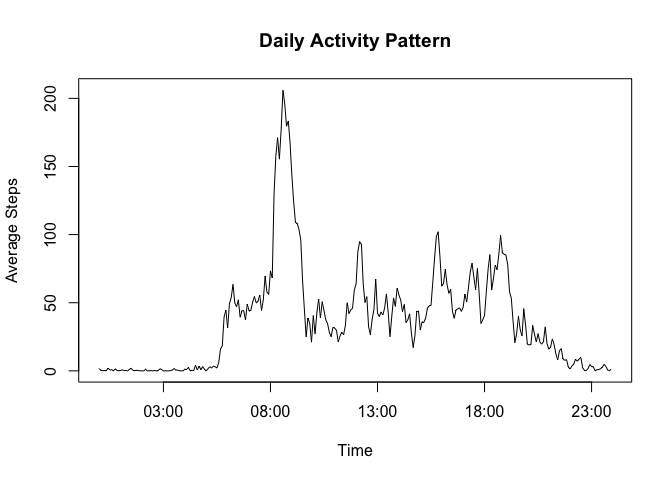

# PA1-RR
pdm  
20 July 2015  
In this assignment, we are going to use data from a personal activity monitoring device. We will use some data analysis and generate exploratory plots. The assignment has five sections.

1. Loading & Processing Data
The dataset has three columns. The interval column has intiger value 5 min gap from 0 to 23 h. Hence another column with appropriate timestamp is added. Another additional column specifying weekdays/weekends are added. 


```r
setwd("~/Documents/Data-science/Reproducible Research/RepData_PeerAssessment1/")
#read data
library(dplyr)
```

```
## 
## Attaching package: 'dplyr'
```

```
## The following objects are masked from 'package:stats':
## 
##     filter, lag
```

```
## The following objects are masked from 'package:base':
## 
##     intersect, setdiff, setequal, union
```

```r
library(ggplot2)
require(scales)
```

```
## Loading required package: scales
```

```r
activity <- read.csv("activity.csv",header = TRUE)

#process data
str(activity)
```

```
## 'data.frame':	17568 obs. of  3 variables:
##  $ steps   : int  NA NA NA NA NA NA NA NA NA NA ...
##  $ date    : Factor w/ 61 levels "2012-10-01","2012-10-02",..: 1 1 1 1 1 1 1 1 1 1 ...
##  $ interval: int  0 5 10 15 20 25 30 35 40 45 ...
```

```r
# To makde 4 digit time intervals 
time_num <- formatC(activity$interval, width = "4", flag = "0")
# the colon (:) needs to be introduced to make %H:%M)
time_hmin <- sub("(..)$", ":\\1", time_num)
# merging date(%Y:%m:%d) and time(%H:%M)
date_time2 <- paste( activity$date,time_hmin, sep = " ")
#mutate in dplyr can not be done on strptime or POSIXlt classes
date_time3 <- as.POSIXct(date_time2, "%F %H:%M", tz = "GMT")
date_time <- mutate(activity, date_time3)
```

Mean of the total number of steps taken per day


```r
new_activity <- date_time %>%group_by(date) %>% na.omit()
sum_steps <- summarise(new_activity, total_steps = sum(steps))
```

2. Histogram of the total steps taken each day

```r
hist(sum_steps$total_steps, xlab = "Total steps per day", main = "Histogram of total steps taken each day")
```


3.The mean and median of the total number of steps taken each day

```r
na1 <- activity %>% na.omit(activity) %>% group_by(date) %>% summarise(total = sum(steps)) %>% summarise(mean = mean(total), median = median(total))
na1
```

```
## Source: local data frame [1 x 2]
## 
##       mean median
##      (dbl)  (int)
## 1 10766.19  10765
```

4. Average daily activity pattern

```r
na2 <- date_time %>% na.omit()
na3 <- na2 %>% group_by(interval) %>% summarise(average_steps = mean(steps))
#A Time column is generated with class POSIXct
time_hmin2 <- as.POSIXct(time_hmin, format = "%H:%M", origin = "2012-10-01", tz = "GMT")
na4 <- mutate(na3, Time = unique(time_hmin2))
#Plot the average number of steps per interval
with(na4, plot(Time, average_steps, type = "l", ylab = "Average Steps", main = "Daily Activity Pattern", xlim = c(min(time_hmin2),max(time_hmin2))))
```



5. Which 5-minute interval, on average across all the days in the dataset, contains the maximum number of steps?


```r
#the interval showing the highest average steps.
na5 <- mutate(na3, Time =unique(time_hmin))
subset(na5, average_steps == max(average_steps))
```

```
## Source: local data frame [1 x 3]
## 
##   interval average_steps  Time
##      (int)         (dbl) (chr)
## 1      835      206.1698 08:35
```

6. Imputing missing values

Missing data can be imputed variously, including Random imputation, Regression imputation etc. In this case, I have tried to impute the missing value with an value which is like to be that value. To simply, I have avoided regression analysis, and used an average of the steps taken at that particular interval in other days and replaced it. The average is rounded off, before replacing NA. 


```r
# Average steps per interval
nax <- activity %>% na.omit(activity) %>% group_by(interval) %>% summarise(avx_steps = mean(steps)) 
# number of times intervals are repeated
re <- nrow(activity)/length(unique(activity$interval))
#make a dataframe of equal number of rows with activity
imp_val <- data.frame(rep(nax$avx_steps, 61))
#rounding of the averages to nearest integer
rounded.val <- round(imp_val, digits = 0)
colnames(rounded.val) <- letters[1]
imputed_activity <- activity
imputed_activity$steps <- ifelse(is.na(imputed_activity$steps), rounded.val$a, imputed_activity$steps )
```

7. Histogram of total number of steps taken each day with the imputed values


```r
#read the amelia outpute file

new_imputed_activity <- imputed_activity %>%
        group_by(date) %>%
        summarise(total_steps = sum(mean(steps)))
#plot the data
hist(new_imputed_activity$total_steps, xlab = "Total steps per day", main = "Histogram of total steps taken each day")
```


Mean and Median of the total number of steps taken in imputed data

```r
Ina <- imputed_activity %>% group_by(date) %>% summarise(total = sum(steps)) %>% summarise(mean = mean(total), median = median(total))
Ina
```

```
## Source: local data frame [1 x 2]
## 
##       mean median
##      (dbl)  (dbl)
## 1 10765.64  10762
```


8. Panel plot comparing the average number of steps taken per 5-minute interval across weekdays and weekends

Create a new factor variable in the dataset with two levels – “weekday” and “weekend” indicating whether a given date is a weekday or weekend day


```r
#add a day column
week <- date_time %>% mutate(day = weekdays(as.Date(as.character(date_time$date), "%Y-%m-%d")))
#convert each workdays as workday
week$day[week$day %in% c("Monday", "Tuesday", "Wednesday", "Thursday", "Friday")] <- c("Weekday")
#convert each weekends as weekend
week$day[week$day %in% c("Saturday", "Sunday")] <- c("Weekend")
week$day <- as.factor(week$day)
#calculate average steps taken in interval across weekdays/weekends
dfweek <- week %>% group_by(day, interval) %>% na.omit() %>% summarise(Mean_steps = mean(steps))
#add another column for interval as POSIXct
dfweek2 <- mutate(dfweek, Time = unique(time_hmin2))
```

Panel plots showing average number of steps taken

```r
#plot the graph with two facets
#in case I had not set tz parameter, so it was taking local tz and and the date_format will be taking GMT as default. 
# attr(dfweek2$Time, "tzone") <- NULL

ggplot(data= dfweek2, aes(x = Time, y = Mean_steps)) + facet_grid(day ~.) + geom_path(color = "red") + scale_x_datetime(labels = date_format("%H:%M")) + ylab("Average Steps") + ggtitle("Time series of average steps in weekdays/weekends")
```


